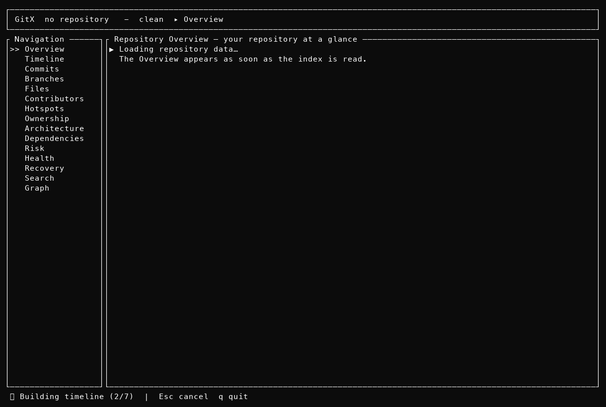

# GitX

> Local-first, terminal-native Git repository intelligence and code archaeology.

[](https://github.com/abuzarkhan1/gitx/actions/workflows/ci.yml)
[](https://crates.io/crates/gitx-cli)
[](LICENSE)

GitX turns a Git repository's history, structure, changes, ownership, branches,
dependencies, and recoverable work into a fast, interactive, explainable
terminal experience — with **no network, no accounts, no AI**. Every score
exposes the raw Git signals behind it.



## Quick start

```bash
# In any Git repository:
gitx
```

`gitx` opens the interactive dashboard: repository health, activity,
hotspots, ownership, branches, architecture, dependencies, recovery — all
explorable with the keyboard or mouse. Your history is indexed into a local
SQLite cache on first use, so everything after that is sub-second.

Prefer the command line? Every capability is a command:

```bash
gitx stats                  # repository statistics
gitx hotspots               # files ranked by maintenance risk
gitx health                 # composite health score, six sub-scores
gitx ownership              # who owns what, and where it concentrates
gitx lineage src/main.rs    # the full life of a file, renames included
gitx blame src/main.rs      # line-level attribution
gitx branches               # divergence, age, shared files, staleness
gitx search "deadlock"      # FTS across commits, files, authors, tags
gitx recovery               # reflog, unreachable commits, dangling objects
gitx dependencies           # declared + lockfile-precise dependencies
gitx symbols                # functions/classes extracted from HEAD
gitx release diff v1.0 v1.1 # what shipped between releases
```

All analytical commands emit machine-readable output:

```bash
gitx --json hotspots
gitx --csv contributors
```

## Install

```bash
# crates.io (CLI only)
cargo install gitx-cli --locked

# cargo-dist installers (CLI + TUI) — one line, from the GitHub Releases page
curl --proto '=https' --tlsv1.2 -LsSf https://github.com/abuzarkhan1/gitx/releases/latest/download/gitx-installer.sh | sh

# Homebrew (when the tap is published)
brew install abuzarkhan1/tap/gitx
```

Then add shell completions:

```bash
gitx completions bash   # zsh / fish / powershell also supported
```

## What makes GitX different

- **Explainable, not black-box.** `gitx risk src/main.rs` prints the formula,
  the time window, and every input (change frequency, churn, bug-fix rate,
  ownership concentration, complexity). No hidden scoring.
- **Local and private.** Everything runs on your machine against your
  repository. Nothing leaves it.
- **Deterministic.** The same repository and configuration produce the same
  results, bit for bit — safe for CI.
- **Built for archaeology.** Rename-following lineage, copy-source tracking,
  symbol history, and recovery of unreachable work are first-class features,
  not afterthoughts.
- **Fast at scale.** A persistent SQLite index means hot queries read
  milliseconds, with phased lazy loading in the dashboard on large
  repositories.

## Documentation

The full specification set lives in [`docs/`](docs/INDEX.md): product
requirements, CLI and TUI specifications, the analysis engine, the database
schema, the recovery model, and a docs ⇄ code audit matrix
([`docs/26-IMPLEMENTATION-STATUS.md`](docs/26-IMPLEMENTATION-STATUS.md)).

## Development

```bash
cargo build --workspace
scripts/check.sh            # fmt + clippy -D warnings + tests
scripts/verify-tui.sh       # headless PTY verification of the dashboard
scripts/bench.sh            # criterion baselines → benches/RESULTS.md
scripts/ansi-to-png.py      # regenerate docs/assets/gitx-dashboard.png from a capture
```

See [`docs/22-CONTRIBUTING.md`](docs/22-CONTRIBUTING.md) and
[`docs/27-RELEASING.md`](docs/27-RELEASING.md).

## License

MIT
