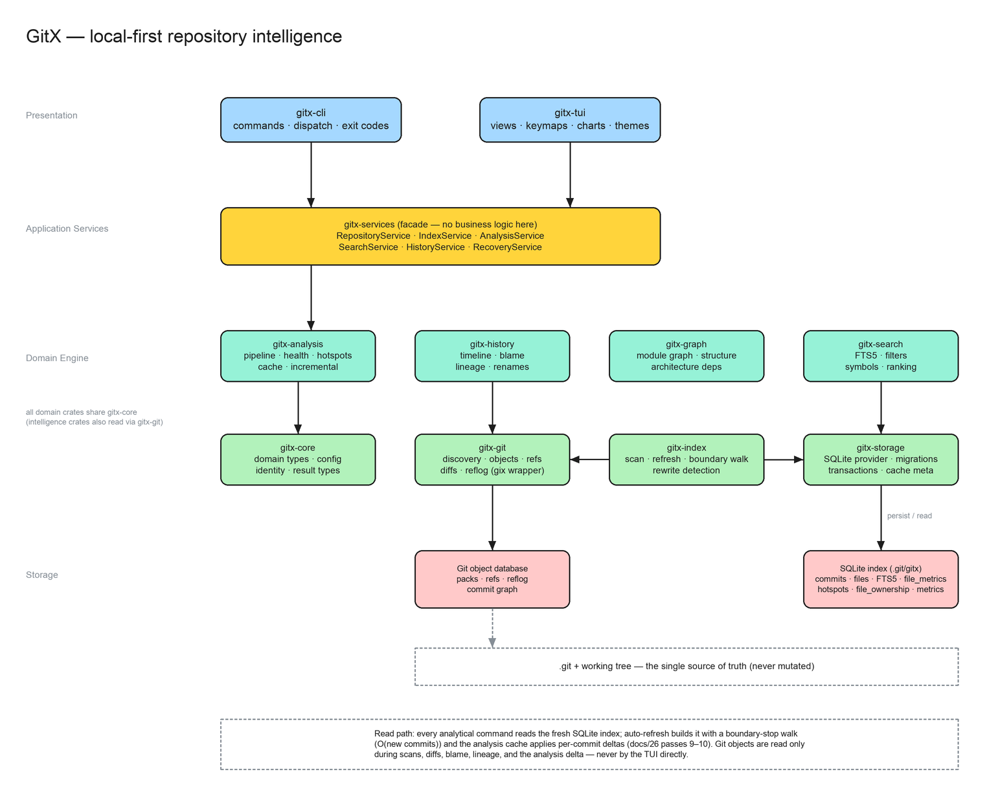

# System Architecture

## 1. Architectural goal

GitX should separate:

- Git access
- domain modeling
- indexing
- storage
- analysis
- presentation

No TUI component should directly traverse Git objects.

## 2. Logical architecture



*The crate layout — presentation → application services → domain engine → storage → git. Editable source: [`assets/gitx-architecture.excalidraw`](assets/gitx-architecture.excalidraw) (open at excalidraw.com or with the Excalidraw VS Code extension).*

```text
CLI/TUI
   |
Application Services
   |
Domain Services
   |
+-------------------------------+
| Git Engine | Index | Storage |
+-------------------------------+
   |
.git + working tree
```

## 3. Rust workspace

```text
crates/
├── gitx-cli/
├── gitx-core/
├── gitx-git/
├── gitx-index/
├── gitx-storage/
├── gitx-history/
├── gitx-analysis/
├── gitx-graph/
├── gitx-search/
└── gitx-tui/

migrations/          # versioned SQLite schema migrations

tests/
├── fixtures/        # deterministic fixture repositories
├── integration/
└── snapshots/

benchmarks/          # criterion benchmark suites

docs/
scripts/

.github/
└── workflows/
```

Analysis subdomains (hotspots, ownership, risk, branch intelligence, dependencies, recovery metrics, repository health) live inside `gitx-analysis` as modules until they warrant extraction into their own crates.

## 4. Responsibilities

### gitx-cli

- argument parsing
- command dispatch
- output mode selection
- exit codes

### gitx-core

- domain identifiers
- shared types
- configuration contracts
- common result types

### gitx-git

- repository discovery
- Git object access
- refs
- commit traversal
- diff extraction
- reflog access
- Git-specific normalization

### gitx-index

- initial scan
- incremental scan
- changed-state detection
- indexing orchestration

### gitx-storage

- SQLite connection
- migrations
- transactions
- repositories/queries
- cache metadata

### gitx-history

- historical reconstruction
- file lineage
- rename tracking
- commit relationships

### gitx-analysis

- metrics
- hotspots
- ownership
- branch intelligence
- risk
- release analysis

### gitx-graph

- graph structures
- traversal
- dependency relationships
- architecture relationships

### gitx-search

- indexing searchable entities
- FTS queries
- filters

### gitx-tui

- terminal rendering
- navigation
- keymaps
- views
- dialogs
- charts
- state presentation

## 5. Dependency direction

Preferred:

```text
gitx-cli ───────────────► application/domain
gitx-tui ───────────────► application/domain
gitx-analysis ──────────► domain/storage abstractions
gitx-history ───────────► domain/git abstractions
gitx-index ─────────────► git + storage + domain
gitx-git ───────────────► git libraries
gitx-storage ───────────► SQLite
gitx-core ──────────────► minimal/no external domain dependencies
```

Avoid circular crate dependencies.

## 6. Application services

Use explicit services such as:

```text
RepositoryService
IndexService
HistoryService
AnalysisService
SearchService
RecoveryService
```

The CLI and TUI invoke these services rather than implementing business logic themselves.

## 7. Data flow

### Initial scan

```text
Repository
   ↓
Discover
   ↓
Read refs
   ↓
Traverse objects
   ↓
Normalize domain entities
   ↓
Persist
   ↓
Build derived indexes
   ↓
Run requested analyses
```

### Incremental scan

```text
Current Git state
   ↓
Compare index state
   ↓
Identify new/changed refs
   ↓
Process delta
   ↓
Update affected entities
   ↓
Invalidate affected derived metrics
   ↓
Recalculate
```

## 8. Explainability architecture

Derived result types should carry evidence references.

Example:

```text
HotspotResult
├── score
├── classification
├── file
└── evidence
    ├── change_frequency
    ├── churn
    ├── bug_fix_count
    ├── ownership_concentration
    └── complexity
```

A UI must be able to show where a score came from.

## 9. Failure isolation

A failure analyzing one file should not destroy the entire repository index.

Use per-operation errors and degraded states:

```text
Indexed
PartiallyIndexed
Failed
Unsupported
```

Unsupported language analysis must not prevent Git history analysis.
